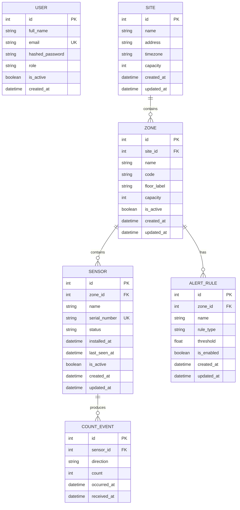

# FlowLens Data Model

## Overview

FlowLens stores anonymous visitor-count events produced by sensors installed
inside physical sites. Raw events are preserved so occupancy, traffic,
peak-hour and historical analytics can be calculated from reliable source data.

## Core Entities

### User
Fields:
- id
- full_name
- email
- hashed_password
- role
- is_active
- created_at

### Site
Fields:
- id
- name
- address
- timezone
- capacity
- created_at
- updated_at

### Zone
Fields:
- id
- site_id
- name
- code
- floor_label
- capacity
- is_active
- created_at
- updated_at

### Sensor
Fields:
- id
- zone_id
- name
- serial_number
- status
- installed_at
- last_seen_at
- is_active
- created_at
- updated_at

### CountEvent
Fields:
- id
- sensor_id
- direction
- count
- occurred_at
- received_at

Valid direction values:
- IN
- OUT

### AlertRule
Fields:
- id
- zone_id
- name
- rule_type
- threshold
- is_enabled
- created_at
- updated_at

## Relationships

- One Site has many Zones.
- One Zone belongs to one Site.
- One Zone has many Sensors.
- One Sensor belongs to one Zone.
- One Sensor has many CountEvents.
- One CountEvent belongs to one Sensor.
- One Zone can have many AlertRules.
- One AlertRule belongs to one Zone.

## Design Rules

1. CountEvent records are immutable after creation.
2. Occupancy is derived from IN and OUT events.
3. All timestamps will be stored in UTC.
4. Site and Zone capacity values must never be negative.
5. Sensor serial numbers must be unique.
6. User email addresses must be unique.
7. Raw sensor events stay separate from derived analytics.

## Entity Relationship Diagram

